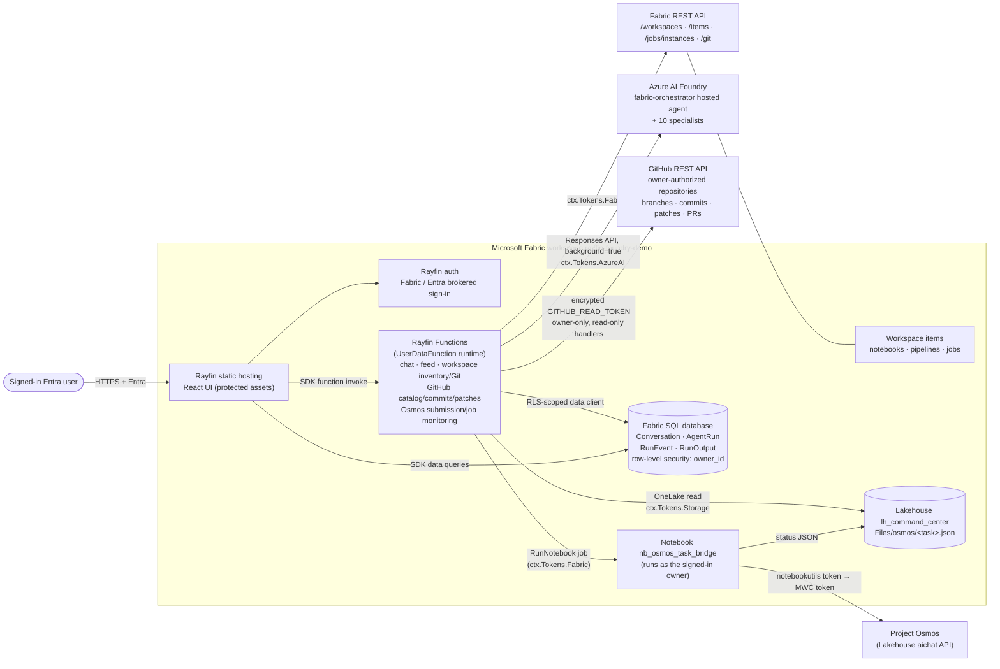

# Agent command center: Fabric Rayfin edition

This is a Fabric-native rebuild of the **Fabric agent command center** dashboard. The original lives in `fabric-foundry-agents/fabric-orchestrator/github-bridge/` and runs as an Azure Function with Azure Table Storage. This version is a **Fabric App (Rayfin, preview)**: the UI, the backend functions, the data store and sign-in all run inside Microsoft Fabric workspace `rayfin-foundry-demo` (`8b835744-f17d-44ef-b43a-3fe3d51c8e35`).

The original dashboard is untouched. Both versions call the same Foundry hosted agent `fabric-orchestrator` (project `fabric-dev-agents`, account `cog-5uza2luofj7sk`).

## Deployed items

| Fabric item | Name | Id |
|---|---|---|
| AppBackend (Rayfin app) | agent-command-center | `e523a252-bf41-4a92-bd47-a4dac0a8f761` |
| SQLDatabase (Rayfin data) | agent-command-center | `eb3c1768-51b7-46a0-8f6f-775902981707` |
| SQLEndpoint | agent-command-center | `29d3e277-8753-41d2-b00c-a6a15857ace0` |
| UserDataFunction (Rayfin functions) | agent-command-center | `7a029fc3-967e-44d9-bb12-36083a45e841` |
| Notebook (job-panel demo) | nb_command_center_heartbeat | `44c03576-9ed9-401d-a2cb-558e2b152d41` |
| Notebook (Project Osmos bridge) | nb_osmos_task_bridge | `b7f8e241-eb04-4200-88e6-2b8a0d6e2170` |
| Lakehouse (app state: Osmos bridge status files) | lh_command_center | `c730a3d5-fa4b-45f4-a82e-4d3af927309d` |

- **Open in Fabric:** <https://app.fabric.microsoft.com/groups/8b835744-f17d-44ef-b43a-3fe3d51c8e35/appbackends/e523a252-bf41-4a92-bd47-a4dac0a8f761?ctid=c37a5dca-2606-44ee-9cd7-78f8ebf834ec>
- **Hosted app (Entra sign-in required):** <https://hazel-brook-637cf5ffd1-westus3.webapp.fabricapps.net>. Anonymous requests return HTTP 401.

## Architecture



### How a chat run works

1. **`startRun`**
   - Creates or reuses a `Conversation` row and an `AgentRun` row (status `working`).
   - **Attaches Fabric workspace context** (app owner only). The Foundry agent identities can only reach the workspaces they have roles on. So when a prompt names a workspace (by name, id or URL), the app resolves it with the owner's Fabric token and adds the inventory to the prompt: items, plus the tables of any lakehouse in a pasted URL (capped at 12,000 characters). The agents then answer from it instead of failing with `403 InsufficientPrivileges`. The orchestrator feed entry says which workspaces were attached.
   - Calls the orchestrator's Responses endpoint with `background: true`, so the call doesn't hit the 240-second function timeout.
   - Chains follow-up prompts in a conversation through `previous_response_id`.
2. **`pollRun`** (UI polls with bounded backoff, 2-15 seconds)
   - Reads the Foundry response.
   - Turns orchestrator and specialist activity (delegation tool calls and their outputs) into `RunEvent` rows: the **live feed**.
   - Splits the final answer into 3,900-character `RunOutput` chunks, which keeps each row under the Rayfin 4,000-character text limit.
   - Preserves Responses terminal states: `completed`, `failed`, `cancelled`, `incomplete`. Pending calls without matching output are not falsely marked completed; their unresolved status settles with the parent run.
   - Runs older than 20 minutes are failed as stale, measured from the persisted start time. A submission without a response id settles after 90 seconds.
   - Clears the conversation's active-run pointer on terminal states and reconciles legacy dangling Working events. Reopening history or reloading resumes a nonterminal run using its stored response id.
   - Extracts the **Project Osmos handoff**. It prefers a structured `osmos_create_task` / handoff JSON. If none is present, it falls back to the delegation the orchestrator sent `osmos_data_engineer`: workspace id, the `LH_Osmos` lakehouse id, display name and composed instruction. The `osmos_data_engineer` agent returns `USER_ACTION_REQUIRED` with the handoff only as prose, because Osmos rejects agent identities.
3. **The UI**
   - Shows the reply in the chat.
   - Drives the **agent graph** from real `delegate_to_specialist` calls and their call-id-matched outputs. Mentioning an agent in answer text never fabricates activity. Latest terminal events take precedence over earlier Working events.
   - Displays the orchestrator and ten configured specialists: `guideline_auditor`, `fabric_architect`, `data_engineer`, `osmos_data_engineer`, `code_reviewer`, `integration`, `fabric_iq`, `power_bi`, `power_grid`, `fabric_automation`. Unknown specialists actually observed in responses remain visible; the retired release-intelligence agent is excluded.
   - Lists the **History** of conversations from `Conversation` rows.
   - Pauses monitoring visibly after five consecutive polling errors; manual refresh resumes it. It does not label paused or timed-out monitoring as a successful run.

All chat submissions go to `/agents/fabric-orchestrator/endpoint/protocols/openai/responses?api-version=v1`. Hosted Responses may reveal specialist call/output evidence only at completion. Until the provider exposes that evidence, the dashboard shows the known orchestrator status, not guessed specialist activity.

Every row has `owner_id` = the caller's Entra object id, and Rayfin row-level security (`claims.sub.eq(item.owner_id)`) limits each user to their own history and feed.

## Features compared with the old dashboard

| Capability | Old dashboard (Azure Function) | Rayfin edition (Fabric) |
|---|---|---|
| Hosting | Azure Function App `func-api-fsxqsgdsfzuuk` + inline `dashboard.html` | Rayfin static hosting in the Fabric workspace (protected assets) |
| Sign-in | Function keys + separate Easy Auth | Native Fabric / Entra sign-in; no keys in the browser |
| Chat with orchestrator | `POST dashboard/runs` + poll | `startRun` + `pollRun` (Foundry background responses) |
| New conversation / History | Azure Table Storage | Fabric SQL database (`Conversation`, `AgentRun`, `RunOutput`) with per-user row-level security, queryable through the SQL endpoint |
| Agent graph | Original roster driven by the live-feed table | Orchestrator + ten current specialists; truthful call/output evidence, terminal reconciliation |
| Live feed of delegations | Agent writes to Table Storage via `report_agent_activity` | Derived from the Foundry response itself (delegation tool calls and outputs), so no extra agent write path is needed |
| Fabric job tracking | `fabric_jobs` table written by the agent | Selectable live workspaces, grouped item inventory, native job-instance states, Git status and uncommitted changes |
| Repository / PR panel | GitHub branch, changed files, PR, code review | Separate GitHub and Fabric sections; repo/branch selectors, real commit authors/messages/SHA links/times, changed-file patches, open branch PRs, Fabric branch-workspace selection |
| Project Osmos | OBO sign-in card → create task → Git finalize | Osmos card → **Create Osmos task**. The app runs the Fabric notebook `nb_osmos_task_bridge` as the signed-in owner. The notebook creates and monitors the task, and the card auto-refreshes its status from OneLake. Owner only (see limitations). Git finalize is not ported. |
| Look and accessibility | Single page, fixed layout | Viewport-bounded panels, fixed scrolling chat and pinned composer, light/dark theme, skip link, ARIA live regions, keyboard-reachable controls |

## Design decisions

1. **Rayfin, not a custom web app.** Fabric Apps (Rayfin) is the in-workspace app platform. It is an `AppBackend` item that provisions:
   - static hosting;
   - auth;
   - a Fabric SQL database for entities;
   - a `UserDataFunction` item for server code.

   It's deployed with `rayfin up`, and everything stays in the workspace.
2. **Fabric SQL database instead of Lakehouse/Eventhouse.** Rayfin data entities are backed by a Fabric SQL database, which gives:
   - transactional writes;
   - row-level security;
   - the SDK query API;
   - free SQL-endpoint access for analytics.

   A separate Eventhouse would have needed a second write path for no gain at this scale.
3. **The live feed is derived, not pushed.** Instead of relying on the agent's `report_agent_activity` tool (which still writes to the old Table Storage), `pollRun` derives specialist events from the Foundry response output, so feed and run state can't drift apart.
4. **Foundry background mode.** Rayfin functions have a 240-second timeout. Orchestrator runs with several specialists can take longer, so `startRun` returns right away and the UI polls.
5. **Credentials.**
   - Functions use `ctx.Tokens.AzureAI` and `ctx.Tokens.Fabric`, which Rayfin issues for the app identity.
   - No secrets, keys or connection strings are stored in code or in `rayfin.yml`. GitHub reads use `ctx.Secrets.GITHUB_READ_TOKEN`, encrypted through `rayfin secret set`; generated files contain only the secret name.
   - The publishable key (public by design) lives only in the git-ignored `rayfin/.deployments.json` and the generated `.env.local`.
6. **Least privilege for external reads.** Other callers are restricted to the app workspace (`ALLOWED_WORKSPACES`). Only the verified app owner can browse other accessible workspaces or use the GitHub credential. GitHub handlers only issue read requests; repo choices come from the credential's accessible catalog, not a fabricated roster. The currently configured credential is the deploying owner's authenticated GitHub user credential, not a GitHub App installation token.
7. **Osmos guard.** Because function tokens are the app identity, not the caller (see limitations), `createOsmosTask` refuses to run unless the signed-in caller *is* the app identity. Otherwise any user could create Osmos tasks under someone else's name. Workspace-context enrichment has the same guard.
   - The owner match compares every object id the caller token carries (`oid`, the bare `sub`, or a `/users/<oid>` path in `sub`) with the app identity's `oid`, and compares the `email`/`upn`/`preferred_username`/`unique_name` claims with its `upn`. All comparisons are case-insensitive.
   - The UI retries `whoAmI` with backoff and shows "Checking your sign-in…" while it waits. It shows the owner-only note only when the server says the caller is *not* the owner. If `whoAmI` keeps failing, the button stays enabled and the server-side guard decides. Previously, one failed `whoAmI` call (e.g. on a cold start) greyed the card out even for the owner.
   - **LH_Osmos resolution.** Agent-composed handoffs have labelled another lakehouse as `LH_Osmos` (e.g. `bronze_layer_lh`). So `pollRun` and `createOsmosTask` look up the lakehouse named `LH_Osmos` in the handoff workspace with the Fabric API, then use its id. They also rewrite the wrong id wherever the instruction labels it as `LH_Osmos` or the default lakehouse. Other lakehouse ids, such as sources, are untouched. The corrected handoff is persisted on the run. If the workspace has no `LH_Osmos`, the task is refused: the app never falls back to another lakehouse.
8. **Osmos through a notebook bridge.** Project Osmos's `generatemwctoken` returns **401** for the Rayfin function token. That token is a delegated user token (`aud` `https://api.fabric.microsoft.com`, scopes include `Item.ReadWrite.All`), but it's issued to the Rayfin client app (`7850f9b4-…`), which Osmos rejects. A notebook token from `notebookutils.credentials.getToken('pbi')` is accepted. So:
   - `createOsmosTask` submits `nb_osmos_task_bridge` through the Jobs API. The job runs as the submitter, so the task is created as the signed-in user, which is native inside Fabric.
   - The notebook creates the task, then polls its status every 30 s for up to 20 minutes. It writes `Files/osmos/<taskId>.json` in `lh_command_center`.
   - `getOsmosTask` reads that file through OneLake with `ctx.Tokens.Storage`.
   - Submission persists the validated Fabric job `Location`, instance id and start time. Reads poll the actual notebook job, then the Osmos status file. If the bridge finishes while the task is still running, another notebook invocation uses `mode=status` and the existing task id, never creates another task. Monitoring resumes after reload and is bounded to two hours; failures/timeouts are visible and polling stops on terminal states.

   The task ID is assigned up front, so the "Open in Fabric" link works immediately. The notebook validates its inputs (GUIDs, an `abfss://` result path), uses no hardcoded workspace or lakehouse ids or OneLake endpoints, and passes the repo's `FAB001`–`FAB010` notebook checks.
9. **Non-destructive Fabric branch selection.** The branch selector offers existing accessible workspaces connected to the same provider/repository/folder, and switches the live view to the selected branch's workspace. It never disconnects, reconnects, syncs, deletes or overwrites items. Normal reads use Fabric's native `/git/workspaceRelations` plus previously viewed connections cached for five minutes under the app's tenant/user/application identity; no token is logged or exposed. Manually connected branch peers may have no Fabric relation: select their workspace once to make their verified connection available, or use **Discover additional branch workspaces**. Explicit full discovery scans 40-workspace pages with eight concurrent reads per batch, paced at least one second apart. HTTP 429 resumes from the interrupted batch after bounded Retry-After; discovery pauses visibly after five minutes. Known branches stay selectable while more are being discovered. Unavailable metadata produces explicit partial-list warnings. Full discovery in this 579-workspace tenant was throttled before finishing; ordinary workspace and known-branch selection avoid that fan-out. Discovery is cancelled when its source workspace changes. A remote branch without an existing connected workspace is not selectable; provision it with the Fabric Git branch-workspace workflow first.
10. **Live-view bounds and refresh.** Jobs refresh every 10 seconds while active, Git status operations every five seconds, otherwise workspace data every minute. Git status HTTP 202 is followed through its operation id rather than starting overlapping operations. Catalogs are bounded to 5,000 workspaces, 500 items per workspace, and 1,000 GitHub catalogs/branches/file entries, with explicit errors beyond the bounds. Commit history shows the latest 15 commits, up to 30 open branch PRs, and at most 30,000 patch characters per file. Jobs show the latest five instances for up to 25 runnable items and 40 total jobs; warnings expose partial/unavailable history rather than pretending it is complete.
11. **"Working" only for genuinely active runs.** Agent graph nodes, edges, pulses, chat specialist chips and the live region are derived from the persisted run status, not merely from delegation evidence or a response id:
   - `effectiveAgentStatus` (shared) resolves a dangling `working` event of a terminal run to the run outcome (orchestrator) or `incomplete` (specialist). The server applies it in every `RunView`; the UI applies it again.
   - The graph resolves per run, then prefers events of runs that are still `queued`/`working`; a working event from an older run can no longer outrank newer terminal outcomes. The orchestrator node mirrors the active or newest run.
   - Edges are dashed and nodes pulse only for `working`; the status legend is static (it previously used the spinning `Working` icon, which animated even when no run existed).
   - `mergeRunUpdate` drops poll results that are older than, or regress from, the terminal state already shown.
   - Osmos/Fabric jobs are separate (`osmos_task` is not a graph agent); when one is still running after the orchestrator finished, the graph says so in text instead of animating agent arrows.

## Rayfin preview limitations found (and workarounds)

| Limitation | Effect | What this app does |
|---|---|---|
| Tenant setting **AppBackendTenant** (Fabric Apps) is off by default; the capacity override alone is not enough | `403 FeatureNotAvailable` on `rayfin up` | Enabled at tenant level **for the security group `sg-fabric-app-items-preview` only** (`a4a0d12f-ca32-4e6e-9c84-c16c6a2ccce0`, member: admin), with `delegateToCapacity=true`, plus a capacity override for `c59bb3a9-…`. It took about 4 minutes to propagate. |
| No per-user on-behalf-of tokens in functions: `ctx.Tokens.*` are the **app identity** (the deploying owner) | Foundry and Fabric calls run as the app owner, not the caller | Data access is still per-user (RLS). Nonowners are restricted to the app workspace; cross-workspace/GitHub reads and Osmos creation are owner-only. |
| The worker detects the context parameter only from the literal annotation `RayfinContext<…>` | An aliased type gives `400 MissingInput` at runtime, and `validate:functions` doesn't catch it | Every handler spells out `RayfinContext<UniversalAppSchema, AudienceType.X>` |
| Function type generation emits names of types imported from package `.d.ts` files | The generated `types.ts` fails to compile | Handlers return `Promise<Wire<T>>` (a local mapped type), so types are emitted structurally |
| Data queries without `.select([...])` return only `id`; mutation results aren't reliable for fields | Missing fields | Explicit field lists (`RUN_FIELDS`, `EVENT_FIELDS`, `CONVERSATION_FIELDS`); re-read after writes |
| RLS `claims.sub` is the Entra **object id**, while the raw session `sub` is a long path | Rows written with the raw `sub` are invisible | `owner_id` = the `oid` claim (or the trailing `/users/<oid>` of `sub`) |
| Text columns max 4,000 characters; functions time out at 240 s | Long answers and long runs | Chunked `RunOutput`; Foundry `background: true` + polling |
| Hosted sign-in in automation needs an interactive passkey | Headless browser tests can't sign in to the hosted URL | Verified with the same SDK + brokered Entra exchange (see Evidence) |
| CLI 1.36.1 quirks | `rayfin dev` local functions host fails with `same key … AZURE_FUNCTIONS_ENVIRONMENT`; `rayfin … --help` can hang; npm 10 arborist bug | Run the frontend locally against the deployed functions (`RAYFIN_REMOTE_FUNCTIONS=1`); install with `npx -y npm@11 install` |
| Project Osmos rejects the Rayfin function token (`generatemwctoken` → 401). The frontend only gets a brokered Rayfin session, never a raw Entra token. | Osmos tasks can't be created directly from a function | Notebook bridge `nb_osmos_task_bridge` (design decision 8) |
| The Foundry agent identities only have roles on workspace `osmos-foundry-demo` | Asking about other workspaces made specialists fail with `403 InsufficientPrivileges` | The app attaches the owner's workspace inventory to the prompt. Alternative (not done automatically, since it's a security decision): grant the agent identities Viewer on the other workspaces. |

## Deploy and update

Prerequisites:
- Node 20+.
- An Entra account with Contributor on the workspace.
- The Fabric Apps tenant setting enabled for you (see above).
- Foundry access for the app identity on project `fabric-dev-agents`. This is the user who runs `rayfin up`.
- An active capacity. During overhaul validation, capacity `c59bb3a9-b731-493f-b2e5-3c131f79d479` returned `CapacityNotActive`; its existing backing resource `fabricdemocapacity123` was resumed without changing the SKU or assigning workspaces.
- An owner-authorized GitHub credential for the optional GitHub view. Use the narrowest read permissions that cover repository metadata, commits and pull requests.

```powershell
cd fabric-rayfin-dashboard
$env:RAYFIN_TELEMETRY_OPTOUT = '1'
npx -y npm@11 install            # npm 10 hits an arborist bug with this workspace layout

# Quality gates
npm run typecheck
npm run build
npm run lint
npm test                         # 48 frontend tests + 9 backend regression tests
npm run validate:functions

# Store the credential encrypted; never paste a token into source or a command argument.
gh auth token --user christianbjarne | npx rayfin secret set GITHUB_READ_TOKEN --stdin --describe="Owner-authorized GitHub repository reads" --json

# Deploy or update everything (data schema, functions, static site)
npx rayfin up --workspace-id 8b835744-f17d-44ef-b43a-3fe3d51c8e35 --json --yes

# Supporting Fabric items (idempotent): lakehouse lh_command_center + notebook nb_osmos_task_bridge
python scripts/deploy-fabric-items.py --workspace-id 8b835744-f17d-44ef-b43a-3fe3d51c8e35
```

After you change a function signature, regenerate `packages/functions/src/types.ts`. Never edit it by hand:

```powershell
npm run -w @rayfin-app/shared build
npx rayfin dev functions apply
```

Stop the development watcher before final builds. CLI 1.36.1 generates the function contracts before starting the local host; on this machine the host then fails with the documented duplicate `AZURE_FUNCTIONS_ENVIRONMENT` key. Generated contracts can still be checked by the quality gates and deployed to the functioning remote runtime.

### Local development against the deployed backend

```powershell
cd packages\frontend
$env:RAYFIN_REMOTE_FUNCTIONS = '1'   # proxy /functions/* to the deployed backend
node ..\..\node_modules\vite\bin\vite.js --host 127.0.0.1 --port 5173
```

The `rayfinLocalDev` Vite plugin signs you in through the brokered Entra exchange. Data calls and function calls then go to the deployed AppBackend.

### Headless smoke test of the deployed app

```powershell
node scripts/smoke-deployed.mjs                 # whoAmI, workspace status, full chat run
node scripts/smoke-deployed.mjs --skip-run      # identity + workspace/job status only
node scripts/smoke-deployed.mjs --catalog --skip-run  # read-only GitHub/workspace switching checks
node scripts/smoke-deployed.mjs --branches --skip-run --workspace-id 5f46cd37-2c55-46dc-a5b6-12d2abcd5204  # existing main/test branch workspaces
node scripts/smoke-deployed.mjs --prompt "..."  # custom prompt
node scripts/smoke-deployed.mjs --create-osmos --prompt "Use Project Osmos to ..."  # also creates the Osmos task
node scripts/smoke-deployed.mjs --osmos-run <runKey>  # create/refresh the Osmos task for an existing run
```

The script:
- reuses the Rayfin CLI sign-in cache to get a Power BI-audience token with the delegated scope `Item.Execute.All`;
- exchanges it for a Rayfin session through `/api/auth/v1/brokered/token`;
- calls the real functions with the Rayfin SDK.

Tokens are never printed.

## Evidence (verified live)

Overhaul verification against the existing deployed item:
- Run `b52be8b1811e477c83cd88ba53aa0f3b`, conversation `3a8ffcf4-c2b7-42f6-b63a-42b89f4b5a04`, explicitly requested a read-only review by `guideline_auditor` and `fabric_architect`. The correct orchestrator endpoint completed with both requested specialist calls and all three events completed; no upstream routing failure was reproduced. No resources, commits or Osmos tasks were requested.
- `getConversation` restored the completed response from Fabric data. The remote-backed browser restored the same conversation after reload; terminal graph/feed activity did not remain Working.
- Owner identity returned true for object `4f99e30b-38b3-4f03-af1c-586a10b89550`. Owner gating and the server-side `LH_Osmos` mapping remain intact. This overhaul did not create an Osmos task or delete any Fabric items.
- The GitHub catalog returned five accessible repos. Verified `christianbjarne/agentic-dev` and `christianbjarne/fabric-foundry-agents`, alternate branches, real commits/PRs and changed-file patches.
- Workspace selection and live inventories used actual Fabric data. Browser verification switched `git-integration-demo` (`5f46cd37-2c55-46dc-a5b6-12d2abcd5204`, `main`) to `test` (`cec77fd7-c6d7-4554-84bb-16da03b36135`, `test`) with the branch-workspace selector and restored the selection after reload. Full-tenant discovery was separately throttled; normal known/relation-based selection remains available.
- Browser verification used the local Vite frontend against the deployed functions because hosted interactive sign-in blocks headless authentication. Desktop panels and document fit a 1280 x 720 viewport; the chat's messages scroll internally and the composer stays pinned.

The headless smoke test (`scripts/smoke-deployed.mjs`) against the deployed backend:
- `whoAmI` and `getWorkspaceStatus` returned OK.
- `startRun` → `pollRun` reached **completed**.
- Events: `fabric_orchestrator` completed, plus specialist **`guideline_auditor` completed**.
- The reply text was returned, and `getConversation` returned the persisted run.

Browser UI test (local Vite frontend with `RAYFIN_REMOTE_FUNCTIONS=1`, so it uses the **deployed** backend and functions with the real Fabric sign-in):
- The header showed "Signed in with Fabric".
- Prompt: *"Ask the power_bi specialist to name two visuals that fit an outage KPI page."*
- `startRun` 200, then `pollRun` 200 until completed. The chat shows the Power BI answer (KPI cards plus trend line chart).
- Live feed: "Fabric orchestrator – Completed – Answered after 1 specialist delegation(s)" and "Power BI – Completed".
- After a page reload, the conversation was restored, and **History** listed all three conversations.
- The Fabric jobs panel showed `nb_command_center_heartbeat` · RunNotebook · Manual, going from `NotStarted` to **Completed (14 s)**. Job instance: `26497921-18d9-4734-bc34-ae4d82d6a98b`.
- The hosted URL returns HTTP 401 to anonymous requests (assets are protected).

Fix round ("chat not working, Osmos didn't work"):
- **Chat about other workspaces.** Prompt: *"describe osmos-demo workspace"* (a workspace the agents have no role on). Before the fix, the answer said it needed the inventory or hit a 403. After the fix, run `60dd6f9a…` completed, and the answer lists workspace `645a6582-…` with lakehouse `osmos_demo_lakehouse`, its SQL endpoint, and notebooks `01_load_bronze`, `02_transform_silver` and `03_build_gold`, all with ids.
- **Osmos handoff.** Prompt: *"Use Project Osmos to create a Bronze ingestion task in workspace osmos-foundry-demo …"*. Run `10558c9b…` completed with `osmos` set: workspace `d1eee5bb-…`, lakehouse `LH_Osmos` `4fac856c-…`, and the composed instruction. So the Osmos card is shown.
- **Osmos task created as the user through the app.**
  - `createOsmosTask` returned `ok`, task `922418fd-ffa5-4611-9228-fa0215a3a69c`, status `Submitting`.
  - `getOsmosTask` then read `Running` from OneLake, as written by `nb_osmos_task_bridge` after it created the task and read it back from the Osmos API.
  - An earlier direct notebook test (job `e50c6dd8-…`, task `e6e40d44-…`) completed the same way.

## Known gaps

- **Per-user tokens for Foundry and Fabric.** Rayfin functions don't currently offer OBO, so these calls run as the app identity. Osmos runs as the owner through the notebook bridge. Revisit when Rayfin adds user-delegated function tokens.
- **Osmos bridge latency.** The notebook needs a Spark session (about 15–60 s on starter pools) before the task exists. Each bridge invocation monitors for 20 minutes; the app can resume status-only monitoring of an existing task, bounded to two hours.
- **Osmos Git finalize** and automated GitHub code-review execution are not ported. The GitHub section now displays real commits, patches and open PRs, but does not perform writes or reviews.
- **Intermediate specialist visibility.** Hosted Responses exposed specialist calls only at completion in the verified run. The UI cannot truthfully show earlier delegations when the provider has not returned them.
- **Fabric branches.** Selecting a branch requires an existing accessible workspace connected to that branch in the same repo/folder. The UI deliberately does not create branch workspaces or modify Git connections.
- The orchestrator's own `report_agent_activity` tool still writes to the old dashboard's Table Storage. That is agent behavior and was intentionally left unchanged.

## Project layout

```
packages/
  data/       Rayfin entities (Conversation, AgentRun, RunEvent, RunOutput) with owner RLS
  shared/     Wire contracts shared by functions and UI (RunView, WorkspaceStatusView, …)
  functions/  Rayfin Functions: function_app.ts (handlers), foundry.ts, fabric.ts, http.ts
  frontend/   React + Vite UI: components/command-center/*, hooks/use-command-center.ts
rayfin/       rayfin.yml (services, auth, hosting); .deployments.json is git-ignored
fabric/       nb_osmos_task_bridge.Notebook (Fabric Git source format)
scripts/      smoke-deployed.mjs, deploy-fabric-items.py, validate-functions.mjs and template tests
```
